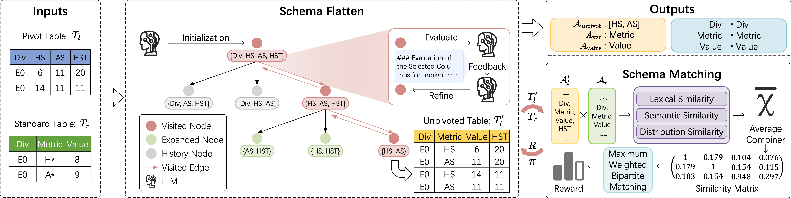

# PiLLar: Pivot Schema Matching via LLM-guided Monte-Carlo Tree Search



**PiLLar** is the first framework designed specifically for *pivot schema matching* — aligning pivot tables with standard relational tables using an LLM-driven Monte-Carlo Tree Search strategy with theoretical convergence guarantees.

The framework achieves **training-free adaptation**, high accuracy with **minimal anonymized sample data**, and introduces the first benchmark dataset for pivot schema matching tasks.

## Repository Structure
```
PiLLar/
├── README.md
├── requirements.txt                  # Python dependencies
├── dataset/                          # All datasets used in experiments
│   ├── adult/
│   │   ├── source.csv                # Pivot table
│   │   ├── target.csv                # Standard table
│   │   ├── column_explanations.json  # Column descriptions
│   │   └── ground_truth.json         # Ground truth mapping
│   └── ...                           # Football, President and Publication datasets
└── src/                              # Source code of the PiLLar framework
    ├── __init__.py
    ├── pillar_globals.py             # Global configuration, shared state, models, caches
    ├── logging_utils.py              # Simple logging helpers
    ├── llm_utils.py                  # OpenAI/LLM client wrappers
    ├── similarity.py                 # Similarity metrics & reward computation
    ├── mcts.py                       # Bounded-stochastic MCTS
    └── main.py                       # Command-line entry point for running PiLLar
```

## Benchmark Datasets
This repository includes the **PTBench** benchmark introduced in the paper — the first dataset designed for schema matching with pivot tables.
| Dataset     | Type              | # Attr. (Pivot → Standard) |
| ----------- | ----------------- | -------------------------- |
| Adult       | Census            | 19 → 19                    |
| Football    | Sports Analytics  | 23 → 13                    |
| President   | Evaluation Metrics| 12 → 4                     |
| Publication | Software Metadata | 8 → 6                      |

## Installation
```bash
git clone https://github.com/ZJU-DAILY/PiLLar.git
cd PiLLar
pip install -r requirements.txt
```
You will need access to an LLM endpoint (Qwen, GPT, Claude, etc.). Specify it via environment variables `PiLLar_API_KEY` and `PiLLar_BASE_URL`.

## Quick Start
```bash
python -m src.main -d football
```